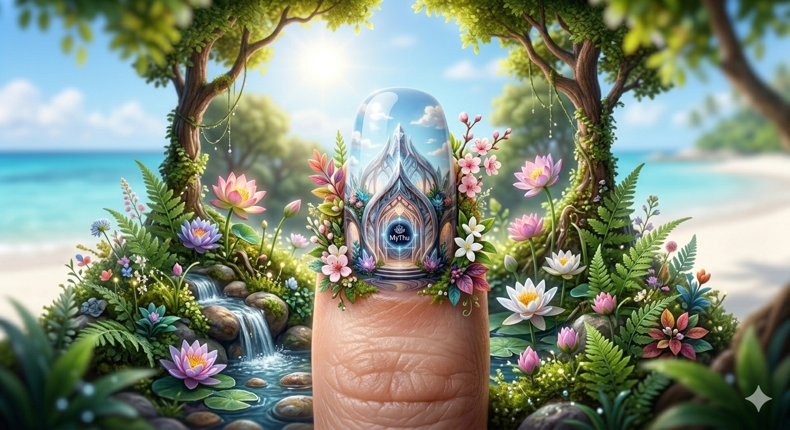

# 🌿 Mỹ Thủ AI - The Hybrid Nail Sanctuary

**Tác giả:** Đặng Nguyên Cường
**Lĩnh vực:** Nail Art & AI Integration
**Slogan:** "Bàn tay nghệ nhân - Trí tuệ máy móc"

## 💎 Tầm nhìn
Sau 20 năm cầm kìm và cọ, dự án này được ra đời để kết hợp **Kỹ thuật Nail truyền thống** (Cắt da, đắp bột) với **Công nghệ AI & Robot** (Tư vấn màu sắc, vẽ 3D tinh xảo). Đây là mô hình tiệm Nail tương lai giúp tối ưu hóa sức lao động và nâng tầm thẩm mỹ.

## 🛠️ Quy trình "Hybrid Nail"
1. **AI Consultant (Agent Mỹ Thủ):** Phân tích sắc tố da, dáng móng và phong cách cá nhân để gợi ý mẫu móng.
2. **Master Craftsmanship:** Thực hiện các kỹ thuật khó như cắt da an toàn, xử lý móng hư tổn, đắp bột tạo form (Do thợ tay nghề cao thực hiện).
3. **Robotic Art:** Sử dụng máy in móng (Nail Printer) để thực hiện các họa tiết 3D, tranh sơn thủy hoặc hoa văn siêu nhỏ với độ chính xác tuyệt đối.

## 🧠 Core Agent: Mỹ Thủ AI
Agent này được huấn luyện với bộ dữ liệu hơn 500+ quy tắc về phối màu cho da người Việt và các mẹo chăm sóc móng từ 20 năm kinh nghiệm.

## 📂 Cấu trúc dự án
- `main_agent.py`: Logic của chatbot tư vấn.
- `knowledge_base/`: Thư viện kiến thức về Nail & Thẩm mỹ.
- `prompts/`: Các câu lệnh huấn luyện AI theo phong cách chuyên gia.
